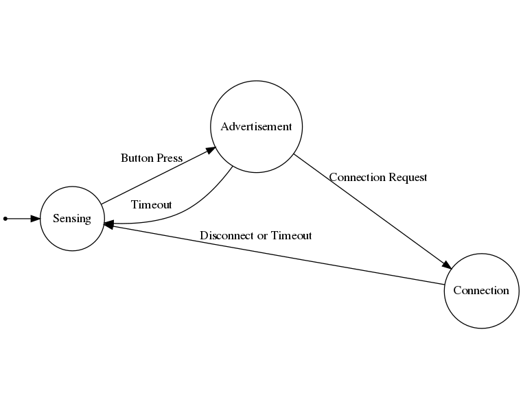
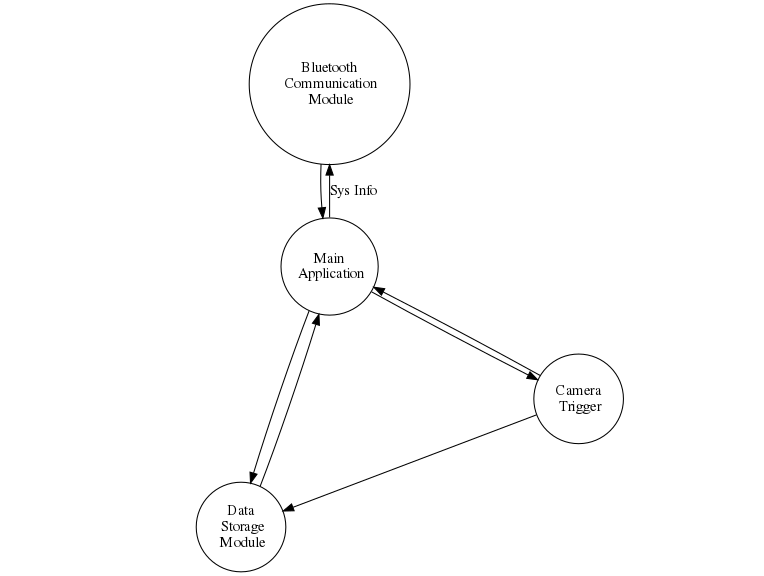

/**
@addtogroup sense_appln
@{

# SensePi Firmware:

[SensePi](https://appiko.org/sensepi.html) is a motion based camera triggering device. This device can be used 
to trigger DSLRs and Point and Shoot cameras. This device can be used as trigger 
for other systems as well. 

There is no active sensor being used in this device.

## Application Explanation

SensePi Firmware is an application which handles multiple modules which serves 
different purpose like handling camera triggering, wireless connection, data 
storage into non volatile memory.

This application also handles events generated by some sub-modules like button
press module, add tick module, irq msg handler, etc.

### Working Principle:

SensePi Firmware works on event driven principle. That means core will wake-up
only when some interrupt or events happens. Other times it'll be in sleep mode. 
This will result into drastic drop in power consumption. Also by making it event 
driven it's response latency is very low. There are almost no instructions to 
perform between event and handler operations. Response time of device is very low.
Control diagram will explain how program's flow is.

Firmware's working can be explained as a state machine having 3 states. 
Application will be always in one these states. These states are:

 - Advertisement
 - Connected
 - Sensing

This state machine mechanism is handled by following sub-modules : 

#### 1 IRQ message sub-module : 

Every interrupt has higher priority than main thread. But while serving an interrupt, 
if some other higher priority interrupt occurs then even interrupt handler will get 
interrupted. To avoid such a undesirable condition, we have implemented a circular 
buffer. IRQ messages are passed through this circular buffer. When we pass a message 
into circular buffer, that interrupt is considered as handled and hence it's handler 
will be executed at main thread level. Here we are using this sub-module to handle 
add ticks and state change events.

#### 2 Button Press sub-module :

Button press sub-module works on button press duration. This sub-module will come into 
play when we press the button. From that instance it'll calculate how long button 
has been pressed. Here we have divide

#### 3 System tick submodule : 

This module generates ticks after certain duration. These ticks can be used for 
different purposes, like waking system up before watchdog bites and resets the 
system, or checking button press duration. 

 
In each state different sets of peripheral modules are active or serving different
requests. In SensePi we use BILE stack for Bluetooth connectivity.

#### 1 Advertisement : 

In this state device's Bluetooth is on and ready to connect. To understand working 
of Advertisement state with respect to BLE stack read this [article](https://devzone.nordicsemi.com/b/blog/posts/bluetooth-smart-and-the-nordics-softdevices-part-1). 
In advertisement device will transmit specified data periodically. Then user can 
connect to device, possibly using 'Appiko setup' app or 'nrf Connect' app. 
Timeout for this state is 5 mins. 

#### 2 Connected : 

In this state device is connected to a mobile device and hence cannot connect
with other mobile device. To understand working of Connected state with respect 
to BLE protocol read this [article](https://devzone.nordicsemi.com/b/blog/posts/bluetooth-smart-and-the-nordics-softdevices-part-2). 
User can send configurations from mobile to device. Timeout for this state is 
10 mins.

#### 3 Sensing : 

This is the default state for device. After Timeout or after disconnect SensePi 
will comeback in this state. This state handles PIR sensing & camera triggering.
There is no timeout for this state. 

By using this state machine approach we were able to avoid a lot of conflicting
scenarios 

### Control Flow Diagram :

The state diagram for SensePi is given below:

As one can see, the default state when SensePi starts it's operation is Sensing. 
If someone presses button present on SensePi, it'll go into Advertising state. 
There it'll wit for 3 mins for Connection request. If it receives connection request 
before 3 mins over, it'll connect with the requesting device. 

Once SensePi connects with some device, it can remain in this state for 10 mins. 
After 10 mins timeout will occur and it'll go back to Sensing state. If user have 
proper mobile device and proper application to change the configuration, user can 
do it in these 10 mins. And user can also terminate connection by sending disconnect 
request. 

This State machine implementation is done by building firmware application in a 
modular structure. There are 3 supporting modules which handles different aspects 
of firmware. Those modules are :

 1. Bluetooth communication module
 1. Camera triggering module
 1. Data storage module

Interaction between these modules and application can be represented as follow :

In the context of of this diagram communication means data transfer between any
two modules. Here all the arrows represent transfer of SensePi_config until specified 
otherwise. Data transfer happens bidirectionally between modules, except for 
2 cases where it's unidirectional.
 
In the context of of this diagram communication means data transfer between any
two modules. Here all the arrows represent transfer of sensepi_config until specified 
otherwise. Data transfer happens bidirectionally between modules, except for 
2 cases where it's unidirectional.
 
As We can observe over there, all modules interact with main application directly. 
Almost all the inter-module communication is done through main application. Only 
once direct communication between two module happens when Camera module saves 
latest configuration in Flash memory through Data storage module. Passing of new 
configuration from Bluetooth communication module to camera trigger module is also 
done through main application. 

On system power reset or firmware update, main application will load the latest 
configuration present in flash memory through Data storage module and will pass it 
on to Camera trigger module.

## Different Modules of application
### Bluetooth communication module

This module handles Bluetooth communication. i.e. this module decides what kind of
data is to be sent over Bluetooth. Structure which is to be used to send the 
data over Bluetooth is defined in this module. This module also handles how to 
serve different requests that it might get while using Bluetooth to communicate 
with other devices. One can refer to data structures over here.(link)

### Camera triggering module

This module handles operation of device when it's in sensing state. This module
handles the camera triggering related operations. This module uses the data sent by
mobile device to Bluetooth communication module and does the required configurations.
 These configurations contains mode of operation (i.e. timer, motion or both),
 light conditions (i.e day, night or both), type of trigger (different modes in 
which cameras can be triggered). 

### Data storage Module

This module handles the storage if data such as current config and firmware id in 
permanent memory. This data enables device to restore the configuration data after 
OTA update is done or if power supply gets disturbed. This module uses flash memory 
to store the data 

@}
*/
